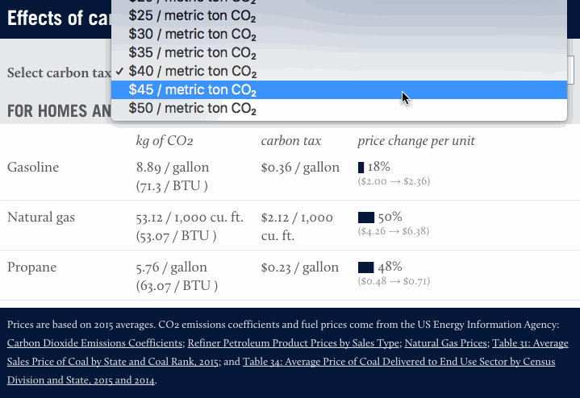

# Interactive Fuel Price Calculator

This interactive shows how much the prices of various fossil fuels would change under  different levels of carbon taxes. For more information on the calculations, please see [the blog post introducing the tool](http://www.rff.org/blog/2017/calculating-various-fuel-prices-under-carbon-tax) by Marc Hafstead at Resources for the Future.

## The code

The graphs are made using D3 v4. The data are pulled via the Google Sheets API so that content editors can easily change the text and numbers if need be without having to get into the code. The dev environment is ES6 JavaScript linted by jshint and compiled by Babel (via Grunt, with help from Browserify).

## License
Work for hire. Copyright is held by Resources for the Future ([more](http://www.rff.org/about/terms-and-conditions-use#copyright)).